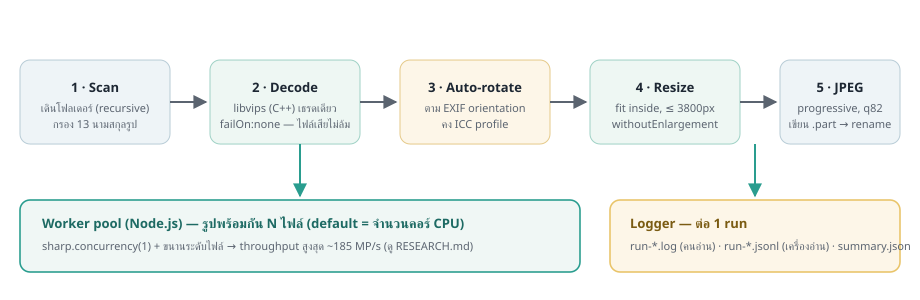

# สถาปัตยกรรม (ARCHITECTURE)

เวอร์ชัน HTML พร้อมแผนภาพ: [architecture.html](https://nardech.github.io/NodeJS_Resizer/architecture.html)



## โมดูล

```
src/cli.js          entry — แยก args (commander) → ถ้าไม่ส่ง args เข้า interactive prompts
src/run.js          orchestrator — scan → sharp.concurrency() → worker pool → progress bar → summary → logger.flush()
src/scanner.js      เดินโฟลเดอร์ (fs.promises) กรองนามสกุล 13 ชนิด, exclude output dir + _logs + hidden
src/converter.js    pipeline ต่อรูป — metadata → rotate(EXIF) → [keepIccProfile|keepMetadata]
                    → resize(inside, withoutEnlargement) → jpeg(q, progressive) → toFile(.part) → rename
src/pool.js         worker pool ขนาดคงที่ — Promise.all ของ N runner แยกไฟล์กัน (ไม่ใช้ worker_threads)
src/logger.js       dual-format logger — เก็บบรรทัดในหน่วยความจำ, flush ครั้งเดียวตอนจบ (.log + .jsonl + summary.json + latest.*)
src/interactive.js  prompts (ลากวาง path ได้, ตัด " อัตโนมัติ, ตรวจว่าโฟลเดอร์มีจริง)
scripts/            make-samples.js (รูปทดสอบ), benchmark.js (วัด concurrency), gen-chart.js (กราฟ SVG), test-run.js (e2e)
```

## การไหลของงาน

1. **Scan** — รวมไฟล์รูปทั้งหมด (recursive ตาม option) เรียงชื่อเพื่อให้ log เทียบข้ามรันได้
2. **Plan concurrency** — workers = จำนวนคอร์ (หรือที่ผู้ใช้ใส่), pin `sharp.concurrency(1)`
   เมื่อ workers > 1 (เหตุผลและข้อมูลใน RESEARCH.md)
3. **Pool** — แจกไฟล์ให้ N runner แบบ "เสร็จคนไหนหยิบต่อคนนั้น" — disk I/O กับ CPU ซ้อนกันเต็มเวลา
4. **Per-file pipeline** — รูปไหนตาย = error รายไฟล์ (failOn:none + try/catch), เขียน `.part` แล้ว rename (atomic) — resume ปลอดภัย
5. **Progress + collect** — cli-progress แสดงต่อเสร็จ; เก็บสถิติ (มิติ, ไบต์, ms) ต่อรูปเพื่อสรุป
6. **Summary + flush** — console summary, top-5 slowest/saving, เขียน `.log` + `.jsonl` + `summary.json` + `latest.*`

## การตัดสินใจเด่น ๆ

- **ทำไมไม่ใช้ worker_threads** — งานฝั่ง JS ต่อรูปเบามาก คอขวดคือ decode/encode ใน C++ ที่ libvips จัดการเอง (ข้อมูลสนับสนุนใน RESEARCH.md)
- **ทำไม logger ไม่ append ทันที** — เขียน log รายไฟล์ 4,904 ครั้ง = I/O overhead ฟรี ๆ; รวมเป็น write ครั้งเดียว (หรือสอง) ต่อรันเร็วกว่ามาก โดยเสียแค่ log ของรันที่ถูก kill กลางทาง (ยอม)
- **ทำไม output เป็นโฟลเดอร์ข้างเคียง** — ตัด bug คลาสสิก "สแกนเจอผลลัพธ์ตัวเอง" ตั้งแต่ต้น
- **ทำไมคง ICC แต่ตัด EXIF** — สีถูกต้องเมื่อดูข้ามอุปกรณ์ พร้อมตัดข้อมูลส่วนบุคคล (GPS/รุ่นกล้อง) ตาม default ที่ปลอดภัย

## Exit codes

| รหัส | ความหมาย |
| --- | --- |
| 0 | สำเร็จ (หรือ skipped ทั้งหมด) |
| 1 | ระบบล้มก่อนเริ่ม (พาธผิด, config ผิด, ไม่พบ input) |
| 2 | ทำงานจบแต่มีไฟล์ error บางไฟล์ (ดู `file_error` ใน log) |
