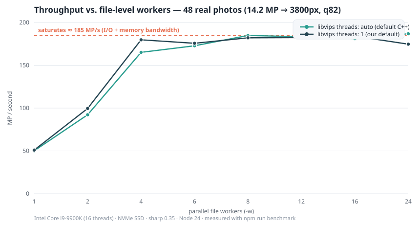

# RESEARCH — วิเคราะห์หาแนวทางให้ประมวลผลรูปได้ "ผลผลิตมากและเร็วที่สุด"

เวอร์ชัน HTML พร้อมกราฟ: [research.html](https://nardech.github.io/NodeJS_Resizer/research.html)

โจทย์คือย่อรูปทั้งโฟลเดอร์ (จำนวนหลักพันรูป, ขนาดรวมหลักสิบ GB) เป็น JPG ที่ด้านยาวสุด ≤ 3800px
เอกสารนี้สรุปการวิเคราะห์ทางเลือก สาเหตุของการตัดสินใจแต่ละจุด และ **ข้อมูลวัดจริง** ที่ใช้เลือกค่า default

## 1. เลือกเอนจิน: sharp (libvips) ทำไม

| เอนจิน | ลักษณะ | เหตุผลที่ (ไม่) เลือก |
| --- | --- | --- |
| **sharp / libvips** | C++ ในตัว, เธรดเนทีฟ, streaming pipeline | **เลือก** — เร็วที่สุดในตลาดสำหรับ decode/resize/encode, ใช้แรมน้อย, ติดตั้งง่ายผ่าน npm (binary สำเร็จรูปทุกแพลตฟอร์ม) |
| Jimp | JS ล้วน | ช้ากว่า 10–50 เท่า, กินแรมมหาศาล — ใช้ไม่ได้กับงานหลักสิบ GB |
| node-canvas | Cairo binding | ติดตั้งยากบน Windows, ไม่ได้ออกแบบมาสำหรับ batch decode รูปกล้อง |
| ImageMagick CLI | process แยกต่อรูป | overhead spawn process ต่อไฟล์, คุม concurrency/log ยาก, ผลคุณภาพ crop/resize ต่างจาก libvips |

ประเด็นสำคัญของ sharp: **งานหนักทั้งหมดเกิดในเธรด C++ ของ libvips อยู่แล้ว** Node.js เป็นแค่ผู้จัดคิว
ดังนั้นการเร่งความเร็วที่ถูกทางคือการจัดการ concurrency ให้ถูกชั้น — ไม่ใช่เพิ่ม worker_threads ของ JS

## 2. โมเดล concurrency — คำถามวิจัยหลัก (และคอขวดที่ซ่อนอยู่)

มีเธรดอยู่ **3 ชั้น** ที่ต้องเลือกให้ถูก:

- **ชั้นไฟล์ (เราคุมได้):** รูปกี่ไฟล์ที่ประมวลผลพร้อมกัน (`-w / --workers`)
- **ชั้น libuv threadpool ของ Node (จุดที่ซ่อนอยู่):** sharp รัน pipeline ของมันบน threadpool ของ libuv,
  ซึ่ง **default มีขนาดแค่ 4 เธรด** — ไม่ว่าจะตั้ง worker กี่ตัว จำนวน pipeline ที่ทำงานพร้อมกันจริงถูกยกเลื่อนที่ 4
- **ชั้นภายใน libvips (เราคุมได้ผ่าน `sharp.concurrency()`):** default = จำนวนคอร์ทั้งหมดต่อ operation,
  ถ้าหลาย pipeline วิ่งพร้อมกันจะแย่งกันใช้ pool เดียวกัน (oversubscription)

### ก้าวที่ 1 — benchmark แรกพบความผิดปกติ

การวัดครั้งแรก (ภาพถ่ายจริง 48 รูป, 4608×3072 = 14.2MP, ย่อเหลือ 3800px, q82, i9-9900K, NVMe):

| workers | MP/s (libvips=auto) | MP/s (libvips=1) | efficiency ต่อ worker |
| ---: | ---: | ---: | ---: |
| 1 | 50.2 | 51.0 | 100% |
| 2 | 92.2 | 99.6 | ~97% |
| 4 | 165.1 | 179.8 | ~90% |
| 8 | 184.8 | 182.1 | ~46% |
| 16 | 181.1 | 184.1 | ~23% |
| 24 | 186.8 | 174.7 | ~16% |

ผลลัพธ์: throughput ดีดขึ้นเกือบเชิงเส้นถึง 4 workers แล้ว**แบนทันทีที่ ~185 MP/s ≈ 4 × 50** —
เส้นโค้งคลาสสิกของ resource ที่จำกัด 4 พอดี ไม่ใช่พฤติกรรมของ CPU/แรม/I-O ที่อิ่มตัว

### ก้าวที่ 2 — ทดสอบยืนยัน: UV_THREADPOOL_SIZE

รันซ้ำด้วย child process ที่ตั้ง `UV_THREADPOOL_SIZE` ต่างกัน (48 รูปเดิม):

| ค่าที่ตั้ง | MP/s | หมายเหตุ |
| --- | ---: | --- |
| workers=16, **UVT=4** (ค่าเริ่มต้นเดิมของ Node) | 162.9–184 | คอขวดที่ threadpool ขนาด 4 |
| workers=8, UVT=8 | 229.2 | |
| workers=12, UVT=12 | 251.6 | |
| workers=16, UVT=16 | 242.1–262.0 | |
| workers=24, UVT=24 | 254.7 | |
| workers=16, UVT=16, libvips=auto | 173.3 | oversubscription — หลาย pipeline แย่ง vips pool เดียว |
| workers=16, UVT=16, cache=off | 248.7 | vips operation cache ไม่จำเป็นสำหรับงานผ่านครั้งเดียว |

และวัด **CPU utilization จริง** ระหว่างรันชุด 240 รูป (สุ่มค่า LoadPercentage ทุก 0.5 วินาที):

| | throughput | CPU เฉลี่ย | พีค |
| --- | ---: | ---: | ---: |
| ก่อนแก้ (UVT=4) | 180.6 MP/s | **53%** | 76% |
| หลังแก้ (UVT=16) | 262.1 MP/s | **94%** | 100% |

### ก้าวที่ 3 — benchmark ทางการหลังแก้ (UVT = จำนวนคอร์)

| workers | MP/s (libvips=auto) | MP/s (libvips=1) | เร็วขึ้น ×1 worker |
| ---: | ---: | ---: | ---: |
| 1 | 50.3 | 51.0 | 1.0× |
| 2 | 97.8 | 98.4 | 1.9× |
| 4 | 174.4 | 174.2 | 3.4× |
| 6 | 227.0 | 222.1 | 4.4× |
| 8 | 238.4 | **257.8** | 5.1× |
| 12 | 243.1 | 254.4 | 5.0× |
| 16 | 261.7 | **262.0** | 5.1× |
| 24 | 259.5 | 259.5 | 5.1× |

(ตัวเลขเต็มต่อเคสอยู่ใน `bench/results.json` เมื่อรัน `npm run benchmark` บนเครื่องตัวเอง)

### สิ่งที่ข้อมูลบอก

1. **คอขวดเดิมคือ libuv threadpool (4 เธรด)** — แก้ด้วย `UV_THREADPOOL_SIZE` แล้ว throughput โดดจาก ~185
   ไป **262 MP/s (+42%)** และ CPU จาก 53% เป็น **94%**
2. **การขนานให้ผลดีถึง 8 workers** (51 → 258 MP/s, 5.1 เท่า); หลังจากนั้นอิ่มตัวที่ ~260 MP/s
   จากการแชร์ SMT/core และ L2/L3 ระหว่าง pipeline (แต่ละ pipeline ยังใช้ cache ส่วนตัวใหญ่ ๆ)
3. **libvips=1 ยังจำเป็นและสำคัญขึ้น**: ถ้าปล่อย auto หลาย pipeline จะแย่ง vips thread pool เดียวกัน (วัดได้แย่กว่าถึง −30%)
4. **default ที่ตัดสินใจใช้**: `UV_THREADPOOL_SIZE = จำนวนคอร์` (ตั้งอัตโนมัติใน `src/entry.mjs` และ launcher),
   `workers = จำนวนคอร์`, `sharp.concurrency(1)` เมื่อ workers > 1, `sharp.cache(0)`
   — และตั้งแต่ v1.0.2 เพิ่ม JPEG baseline + kernel cubic (เหตุผลและข้อมูลในหัวข้อ 7)

### สรุปคณิตเรื่องแรม (วัดจริง ไม่ใช่ประมาณ)

libvips ทำงานแบบ streaming (ส่ง scanline ผ่าน pipeline) จึงไม่เก็บภาพ raw เต็มใบต่อ 1 pipeline;
แรมจริงที่วัดได้ (RSS) ขณะรัน 16 pipeline พร้อมกันกับภาพ 14.2 MP = **~80–170 MB เท่านั้น** จึงปลอดภัยแม้เครื่องแรมน้อย

## 3. ทางลัดที่ libvips ให้ (เปิดใช้แล้วในโค้ด)

| เทคนิค | ผล |
| --- | --- |
| **fastShrinkOnLoad (default ของ sharp)** | ตอน decode JPEG ลดขนาดที่ DCT-domain 1/2, 1/4, 1/8 ก่อนขยายพิกเซลเต็ม — ย่อ 6000→3800 เร็วขึ้นมาก แลกคุณภาพต่างกันเล็กน้อยที่คนตาธรรมดาแทบแยกไม่ออก |
| **sequentialRead: true** | บังคับอ่านไฟล์เชิงเส้น เหมาะกับ SSD/HDD และลด random I/O ตอนไฟล์ใหญ่ |
| **resize fit=inside + withoutEnlargement** | คำนวณมิติปลายทางครั้งเดียว ไม่มีงานสเกลซ้ำซ้อน และไม่ขยายรูปเล็ก |
| **failOn: 'none'** | รูปถ่ายที่ header เน่าเล็กน้อยยัง decode ได้มากที่สุดเท่าที่ทำได้ ไฟล์เสียไม่ทำชุดล้ม |
| **เขียนแบบ atomic (.part → rename)** | กันไฟล์ครึ่ง ๆ กลาง ๆ ตอนถูกขัดจังหวะ — resume ได้จริง |

## 4. ฝั่ง encode — ทำไม q82 + baseline (v1.0.2)

- **quality 82 + chroma 4:2:0** คือจุดต่ำสุดของเส้นโค้ง quality/size ที่ตายากมองไม่เห็น artifact
  ในภาพถ่ายทั่วไป (อ้างอิงแนวปฏิบัติเดียวกันกับเว็บส่วนใหญ่: 75–85)
  ชุดทดสอบ 233 MB → 51 MB (**เล็กลง 78%**) ที่ความยาว 3800px
- **JPEG baseline (default ตั้งแต่ v1.0.2)**: encode เร็วกว่า progressive ~33% แลกไฟล์ใหญ่ขึ้น ~3%
  progressive มีประโยชน์เฉพาะแสดงบนเว็บทีละชั้น — จึงย้ายเป็น opt-in ด้วย `--progressive`
- **mozjpeg (--mozjpeg)**: เล็กลงอีก ~25–30% แต่ encode ช้าลง 2–3 เท่า — ทำเป็นตัวเลือก ไม่ใช่ default
  เพราะโจทย์หลักคือ *เร็ว*; งานที่ส่งของ/เก็บถาวรค่อยเปิด

## 5. กลยุทธ์ระดับชุดงาน (batch-level)

- **Resume-safe**: default ข้ามไฟล์ที่มีผลลัพธ์อยู่แล้ว → งาน 4,904 รูปถูกไฟถือพักกลางทางได้ เสียเวลาแค่ส่วนที่เหลือ
- **Exclude โฟลเดอร์ output จากการสแกน** — กันประมวลผลผลลัพธ์ของตัวเองซ้ำไปเรื่อย ๆ
- **Sort ชื่อไฟล์ก่อนลงมือ** — log ต่อรันเปรียบเทียบกันได้ระหว่างรัน
- **log รวบในหน่วยความจำแล้ว flush ครั้งเดียวตอนจบ** — งานหลักไม่โดน I/O penalty จากการเขียน log ต่อไฟล์
- **dry-run**: สแกน + วัด metadata ทั้งชุด (เร็วมากเพราะไม่ decode เต็ม) เพื่อประเมินเวลา/พื้นที่ก่อนลงมือจริง

## 6. สิ่งที่พิจารณาแล้ว "ไม่" ทำ (พร้อมเหตุผล)

| ทางเลือก | เหตุผลที่ไม่ทำ |
| --- | --- |
| Node.js `worker_threads` | งาน JS ต่อรูปเบามาก (แค่จัดคิว) — คอขวดจริงอยู่ที่ libuv threadpool ซึ่งแก้ตรงจุดด้วย env var แล้ว |
| เขียน multi-process หลาย instance | ซับซ้อน, กินแรมซ้ำ; หลังแก้ threadpool แล้ว CPU วิ่ง 94% แล้ว ไม่มีที่ว่างให้ได้ผลเพิ่ม |
| ใช้ `toBuffer()` + เขียนเอง | เปลืองแรม; `toFile()` ของ sharp stream ลงดิสก์ตรง ๆ ประหยัดกว่า (เขียน .part ก็ยัง atomic) |
| ปรับ `-q` อัตโนมัติตามเนื้อหา | เพิ่ม decode/encode รอบที่สอง — ช้าลงทั้งชุด; ให้ผู้ใช้เลือก q ที่เหมาะกับงานดีกว่า |
| parallel ที่ระดับ libvips (auto) | ผลวัดชี้ชัด: หลาย pipeline แย่ง vips pool เดียวกัน ช้ากว่า pin=1 ถึง −30% |

## 7. การเคาะ default รอบที่สอง (v1.0.2) — แยกวัดรายขั้นของ pipeline

หลังแก้ threadpool แล้ว CPU วิ่ง ~94% คอขวดที่เหลือจึงอยู่ที่งานต่อรูป — จึงแยกวัดแต่ละขั้น
ด้วย pipeline variant (48 รูปเดิม, config เดิมยกเว้นขั้นที่ทดสอบ):

| variant | MP/s(in) | ตีความ |
| --- | ---: | --- |
| pipeline เต็ม (ค่าตั้ง v1.0.1: lanczos3 + progressive) | 268 | จุดตั้งต้น |
| ตัด progressive (JPEG baseline) | **356 (+33%)** | progressive เขียน Huffman หลายรอบ — แพงที่สุด; ไฟล์ใหญ่ขึ้นแค่ 3% |
| เปลี่ยน lanczos3 → cubic | **296 (+10%)** | kernel เร็วกว่า คุณภาพต่างแทบมองไม่เห็นในภาพถ่าย |
| เขียน buffer แทนดิสก์ | 284 (+6%) | ดิสก์ NVMe แทบไม่เป็นคอขวด (เขียน ~17 MB/s) |
| decode เท่านั้น | 898 | decode ≈ 29% ของ pipeline (แก้ไม่ได้ — fastShrinkOnLoad ไม่ช่วยย่อ 1.21×) |
| decode + transpose | 793 | transpose ต้นทุนแค่ ~4% (วัดตรง; A/B แบบตัด rotate ใช้ไม่ได้เพราะเนื้อภาพเปลี่ยนการบีบอัด) |
| อ่าน header (สแกน) | 235 รูป/วินาที | ขั้นเตรียมแทบไม่มีต้นทุน |

**การตัดสินใจ (v1.0.2):** default เป็น **JPEG baseline + kernel cubic** (ความเร็วมาก่อนตามโจทย์)
และเพิ่ม `--progressive` / `--kernel lanczos3` สำหรับคนที่ต้องการไฟล์เว็บ/ความคมสูงสุด;
`--skip-smaller` สำหรับข้ามงานที่ไม่จำเป็น

### benchmark ทางการด้วย default ใหม่

| workers | MP/s (libvips=auto) | MP/s (libvips=1) | เร็วขึ้น ×1 worker |
| ---: | ---: | ---: | ---: |
| 1 | 77.0 | 79.0 | 1.0× |
| 2 | 148.3 | 148.1 | 1.9× |
| 4 | 254.6 | 259.2 | 3.3× |
| 6 | 319.8 | 328.4 | 4.2× |
| 8 | 338.9 | 316.6 | 4.0× |
| 12 | 309.8 | 320.4 | 4.1× |
| 16 | 301.7 | **328.7** | 4.2× |
| 24 | 311.7 | 325.2 | 4.1× |

สรุป: default ใหม่ทำ **~330 MP/s** (workers = จำนวนคอร์) — **+25% จาก v1.0.1, +78% สะสมจาก v1.0.0**;
เร่งจาก 1 เธรด 79 → 329 MP/s (4.2×); โฟลเดอร์ 4,904 รูป 25 GB ≈ 3.5 นาที

## 8. ข้อจำกัดที่รับทราบ

- เพดาน ~330 MP/s (CPU ~100%) วัดบน NVMe + i9-9900K ด้วย default v1.0.2 — บน HDD จะไปติดเพดานการอ่านดิสก์ก่อน (แนะนำ workers 2–4)
- `UV_THREADPOOL_SIZE` ต้องถูกตั้ง **ก่อน** libuv สร้าง pool — เครื่องมือตั้งให้เองใน `src/entry.mjs`/launcher;
  ถ้ารันผ่าน `node src/cli.js` ตรง ๆ โดยไม่ผ่าน entry อาจยังได้ค่า default 4 (แนะนำใช้ `npm start` / resize.bat)
- `fastShrinkOnLoad` อาจให้มิติปลายทางต่างได้ ≤1% จากการคำนวณเชิงทฤษฎีในรูปที่อัตราส่วนพิเศษ
- HEIC ขึ้นกับ build ของ libheif ใน sharp binary (ชุดติดตั้งทั่วไปอ่านได้, บาง variant เข้ารหัสแบบมีสิทธิ์อาจอ่านไม่ได้ — จะถูกบันทึกเป็น error ใน log)
- ตัวเลขในเอกสารนี้มาจากเครื่องเดียว หนึ่งชุดข้อมูล — ใช้เป็นแนวโน้ม ไม่ใช่ค่าสัมบูรณ์ รัน `npm run benchmark` บนเครื่องตัวเองเพื่อข้อมูลตรงเครื่องตัวเอง
